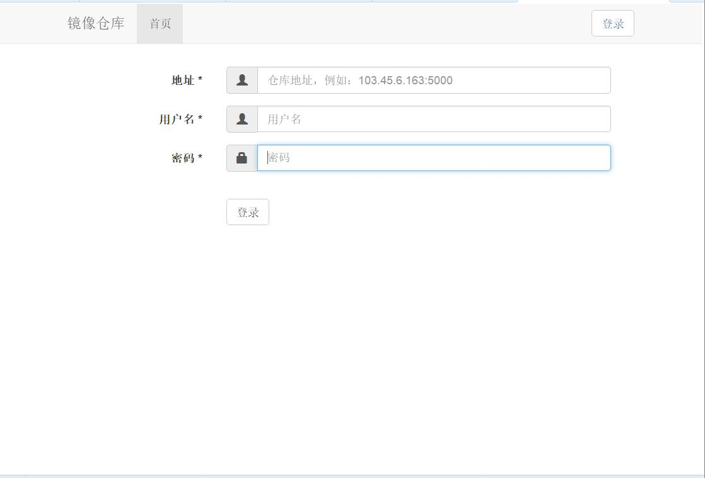
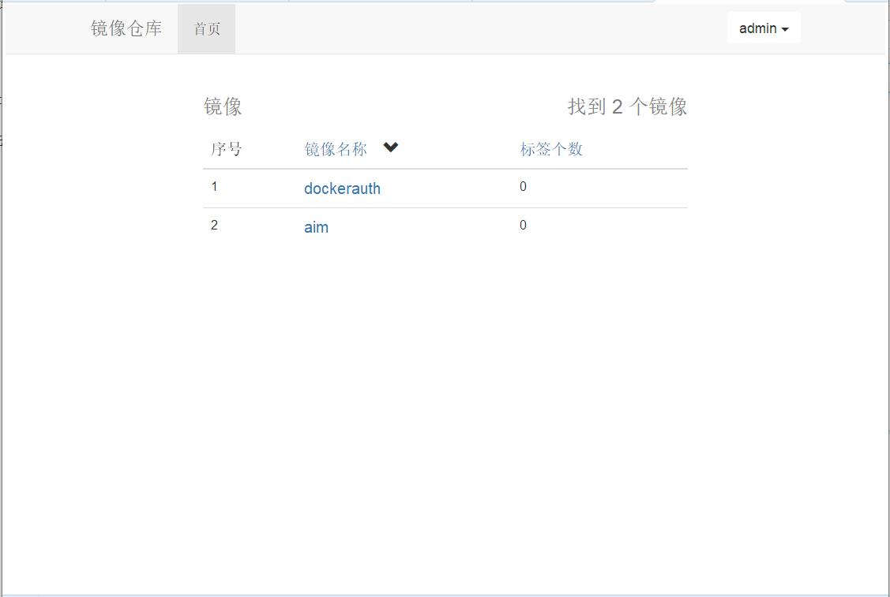
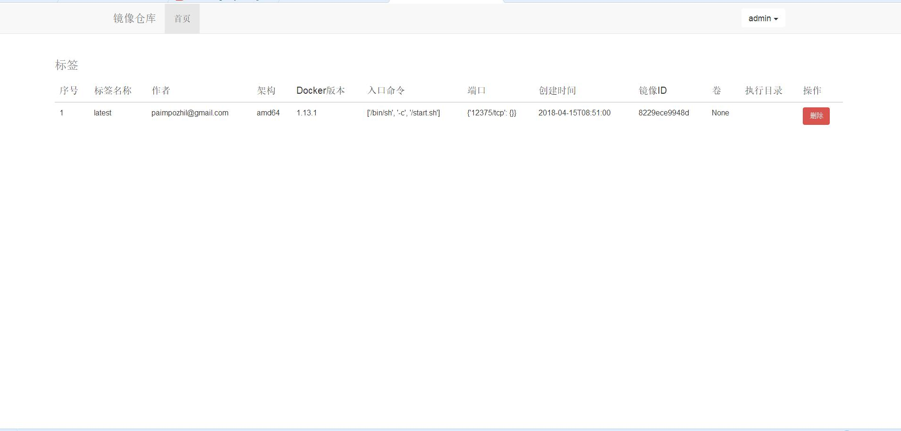

# Docker仓库管理工具

### 源码编译， 需要安装Python3.6.4

- ​        bash build_python3.sh

### 源码编译并安装 rms

- ​        bash build_docker_image.sh 

### 直接拉取镜像

```shell
docker run -itd  --restart=always -p 15000:15000 index.tenxcloud.com/krman/rms:latest
```

### 管理界面访问

- ​        http://103.45.6.163:15000/

  ​


### 登录界面，填写Registry的地址等信息



### 其次, 登陆之后， 展示仓库里面镜像的信息



### 每个镜像的标签信息，标签可删除




